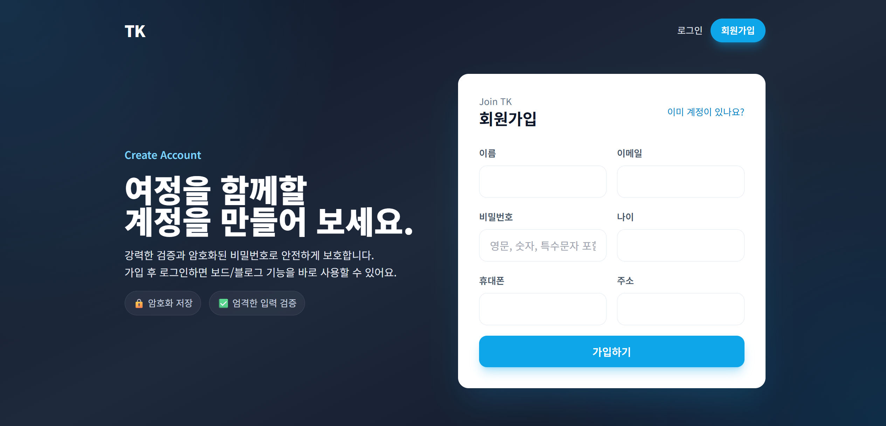

## 4주차: Spring Boot와 MySQL 데이터베이스 연동
### 주요 구현
- **MySQL 연동 및 테스트**: `spring-boot-starter-data-jpa` 및 MySQL 드라이버 의존성 추가. `application.properties`에 데이터베이스 연결 정보 설정.
- **엔티티 설계**: `TestDB.java` (`@Entity`, `@Table(name="testdb")`) 클래스 생성하여 `id`, `name` 컬럼 매핑.
- **레포지토리 생성**: `JpaRepository<TestDB, Long>`를 상속받는 `TestRepository` 인터페이스 구현.
- **데이터 조회 및 출력**: `DemoController.java`의 `/testdb` 매핑 메서드에서 `testService.findByName("Guest")`를 호출하여 데이터를 조회하고, `testdb.html` 타임리프 템플릿에 `th:if`, `th:text`를 사용하여 결과를 출력.

## 5주차: 게시판 개발
### 주요 구현
- **게시글 목록 조회**: `BoardController` 생성 및 `/board_list` 매핑 추가. `BoardService.findAll()`을 호출하여 전체 게시글 리스트 반환.
- **게시글 작성 처리**: `BoardRestController`의 `/api/boards` (POST) 메서드 구현. `AddBoardRequest` DTO를 통해 제목(`title`), 내용(`content`)을 전달받아 `Board` 엔티티로 변환 후 저장.
- **페이지 리다이렉트**: 게시글 작성 완료 후 리스트 화면으로 자동 전환되도록 `return "redirect:/article_list"` 처리 (View Controller).

## 7주차: 게시판 수정·삭제
### 주요 구현
- **게시글 수정 폼**: `BoardController`의 `/board_edit/{id}` (GET) 매핑. PathVariable로 ID를 받아 `boardService.findById(id)`로 기존 데이터를 조회하여 `board_edit.html`에 바인딩.
- **게시글 업데이트 로직**: `BoardService`에 `@Transactional`이 선언된 `update(id, request)` 메서드 구현. Dirty Checking(변경 감지)을 통해 엔티티의 필드 값을 수정하여 DB 반영.
- **전역 예외 처리**: `GlobalExceptionHandler` 클래스 생성 및 `@RestControllerAdvice` 적용. `IllegalArgumentException` 등 발생 시 400 Bad Request 응답 처리.

## 9주차: 게시판(BOARD) 확장
### 주요 구현
- **페이징 처리(Pagination)**: `BoardRepository`의 `findAll(Pageable pageable)` 사용. `BoardController`에서 `PageRequest.of(page, 3, Sort.by(...))`를 생성하여 페이지당 3개씩 최신순 정렬 구현.
- **검색 기능(Search)**: `BoardRepository`에 `findByTitleContainingIgnoreCase` 메서드를 정의하여 대소문자 구분 없는 제목 검색 기능 구현.
- **상세 모달**: `article_list2.html`에서 Fetch API를 사용해 `/api/boards/{id}/view`를 비동기 호출. 응답반환된 JSON 데이터를 모달 창(`view-modal`)에 동적으로 렌더링.

## 10주차: Spring Security 회원가입·로그인
### 주요 구현
- **입력값 검증(Validation)**: `AddMemberRequest` DTO에 `@NotBlank`, `@Email`, `@Pattern`(비밀번호 복잡도) 어노테이션 적용.
- **회원가입 처리**: `MemberController`의 `/api/members` (POST) 메서드에서 `@Valid`로 검증 수행. 실패 시 `BindingResult`를 통해 `join_new.html`로 에러 메시지 전달.
- **비밀번호 암호화**: `SecurityConfig`에 `BCryptPasswordEncoder` 빈 등록. `MemberService`에서 회원 저장 시 비밀번호를 해시 처리하여 보안 강화.

## 11주차: 세션/보안 보강 및 게시판 권한 적용
### 주요 구현
- 세션 최소화: 로그인 시 세션에 `memberId/email/name`만 저장, 로그아웃 시 세션 무효화 + JSESSIONID 쿠키 삭제.
- 권한 검증: 게시글 작성/수정/삭제 시 세션 이메일 검사, 작성자 불일치 시 403/리다이렉트. 작성자 값은 세션으로 강제 주입.
- UI 가드: 목록/카드에서 작성자와 세션 이메일 일치할 때만 수정·삭제 버튼 노출.
- 보안 설정: CSRF 활성(단 JS fetch `/api/**` 예외), 세션 관리 옵션(만료 리다이렉트, 동시 세션 1개 제한) 추가, 허용 경로 정비.
- 세션 설정: 타임아웃 30분, secure 쿠키 옵션 플래그 추가.
- 인터랙션 강화: 홈/프로젝트/팀/스킬 카드에 hover/스크롤 모션, 히어로 배경/CTA에 가벼운 애니메이션 적용.

## 12주차: Spring Boot 포트폴리오 & 게시판 프로젝트 마무리
### 주요 구현
- Spring Boot + Thymeleaf 기반 프로젝트 완성
- 회원가입/로그인 및 게시판 CRUD 로직 최종 정리
- Contact(문의하기) 섹션 및 지도 기능 구현
- 보안 설정(SecurityConfig) 및 전역 예외 처리(GlobalExceptionHandler) 보완

## 연습문제
### 3주차: 프론트엔드 기초 및 상세 페이지 제어
**과제명: 상세 페이지 수정하기 (Window Control)**  
- **핵심 내용:** `about_detailed.html`의 단순 링크 이동 버튼을 JavaScript `confirm()` 제어로 변경.
- **구현 로직:**
  - `static/js/main.js`에 `confirmClose()` 함수 추가.
  - "정말 창을 닫으시겠습니까?" 알림창 확인 시 `window.close()` 실행.

### 4주차: 데이터베이스 기초 및 연동
**과제명: 사용자 추가 및 출력하기 (CRUD Basic)**  
- **핵심 내용:** DB 클라이언트로 데이터 수동 조작 후 웹 반영 확인.
- **구현 로직:**
  - `testdb` 테이블에 SQL `INSERT` 문으로 임의 사용자 직접 추가.
  - `DemoController`에서 데이터를 Model에 담고 `testdb.html`에서 리스트 출력 확인.

### 5주차: 블로그 게시판 기초
**과제명: 페이지 리다이렉트 (Page Redirect)**  
- **핵심 내용:** JSON 반환(@RestController)을 사용자 친화적 웹 흐름(@Controller)으로 변경.
- **구현 로직:**
  - 글 저장(`save`) 후 반환값을 `return "redirect:/article_list";`로 수정하여 목록 페이지 자동 이동.

### 7주차: 게시판 고도화
**과제명: 게시판 페이지 – 글 수정 (Update Logic)**  
- **핵심 내용:** 게시글 내용 수정 프로세스 구현.
- **구현 로직:**
  - **DTO:** `AddArticleRequest` 필드 확장.
  - **Controller:** `/board_edit/{id}` 매핑 및 수정 뷰 연결.
  - **View/Service:** 수정 폼 데이터 바인딩 및 엔티티 필드 업데이트 로직(`update` 메서드) 구현.

### 9주차: 검색 및 페이징
**과제명: 게시판 페이지 - 추가 구현 (Numbering & Delete)**  
- **핵심 내용:** 글 번호 가상 처리 및 삭제 기능 완성.
- **구현 로직:**
  - **가상 번호:** (전체 글 수 - 현재 페이지 * 페이지당 글 수 - 인덱스) 공식 적용.
  - **삭제:** 상세 페이지(`board_view.html`)에 삭제 버튼 추가 및 `delete()` 호출 구현.

### 10주차: 회원가입 및 유효성 검사
**과제명: 입력값 필터링 (Bean Validation)**  
- **핵심 내용:** `spring-boot-starter-validation`을 활용한 데이터 검증.
- **구현 로직:**
  - **DTO:** `@NotBlank`, `@Email`, `@Pattern`(정규식) 어노테이션 적용.
  - **Controller:** `@Valid` 검증 수행 및 에러 발생 시 처리.

### 11주차: 로그인/로그아웃 및 세션
**과제명: 게시판 수정하기 - 작성자 연동 (Authentication Integration)**  
- **핵심 내용:** 하드코딩된 작성자를 로그인한 실제 사용자 정보와 연동.
- **구현 로직:**
  - **글쓰기:** `HttpSession`에서 `userId`/`email`을 가져와 작성자 필드 저장.
  - **권한 제어:** 상세 보기(`th:if`)에서 로그인 사용자와 작성자 일치 시에만 수정/삭제 버튼 노출.

### 12주차: 완성 및 배포
**과제명: 세션 처리 및 파일 업로드 심화**  
- **핵심 내용:** 다중 사용자 테스트 및 예외 처리 강화.
- **구현 로직:**
  - **세션:** 브라우저별 고유 세션(UUID/JSESSIONID) 생성 및 로그아웃 시 파기 검증.
  - **파일:** 업로드 에러 페이지 구현 및 파일명 중복 방지 로직 확인.

## 추가 구현
- 페이지 리디자인
- 직무에 맞는 내용으로 변경(Product Manager)
- 네비게이션 글래스모피즘 적용
- ABOUT ME 섹션 배경 애니메이션 효과 추가
- 게시판 메인화면에서 작성 글 리스트 및 클릭 시 상세 보기 구현
- 게시판 작성자 권한 적용: 로그인 사용자 이메일로 작성자 강제 저장, 작성자만 수정/삭제 버튼 노출 및 서버 검증, 비로그인 시 글쓰기 폼 대신 안내 메시지 표시
 

## 추가 실행 화면 - 클릭 시 동영상 재생 됩니다.

## 추가 실행 화면
- GIF는 자동 반복 재생되며 클릭 없이 흐름을 확인할 수 있습니다.

### 메인 화면
- 랜딩 히어로와 프로젝트 카드 등 전체 홈 레이아웃 흐름

### 스킬 더보기
- 스킬 섹션 확장 애니메이션과 상세 스킬 카드 확인

### 게시판 로그인
- 게시판 접근 시 인증 요구 및 로그인 과정

### 게시판 작성
- 로그인 후 게시글 작성/저장까지의 플로우

### 로그인 화면
- 이메일/비밀번호 입력폼과 에러 안내 UI

### 회원가입 화면
- 신규 계정 정보 입력과 약관 동의 처리
